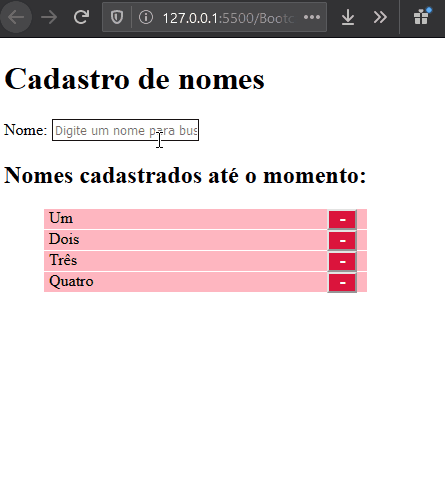

# Cadastro de nomes (CRUD)

## O que faz?

A aplicação é bem simples, e executa as operações de CRUD básicas, são elas:

<ul>
    <li>:heavy_plus_sign: Inserção</li>
    <li>:x: Exclusão</li>
    <li>:pencil2: Edição</li>
    <li>:mag_right: Pesquisa</li>
</ul>

Abaixo um preview da aplicação sendo executada:

## Como foi desenvolvida?

Esta aplicação foi puramente desenvolvida com a linguagem Javascript (sem uso de frameworks).

Não foi utilizado um banco de dados. Os nomes apenas são armazenados em vetores (arrays) e mostrados em tela.

## Por que?

Trata-se de um desafio guiado pelo professor Raphael Gomide no curso de _Desenvolvedor FullStack_ do Instituto de Gestão de Tecnologia da Informação (IGTI).
